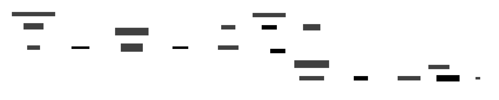
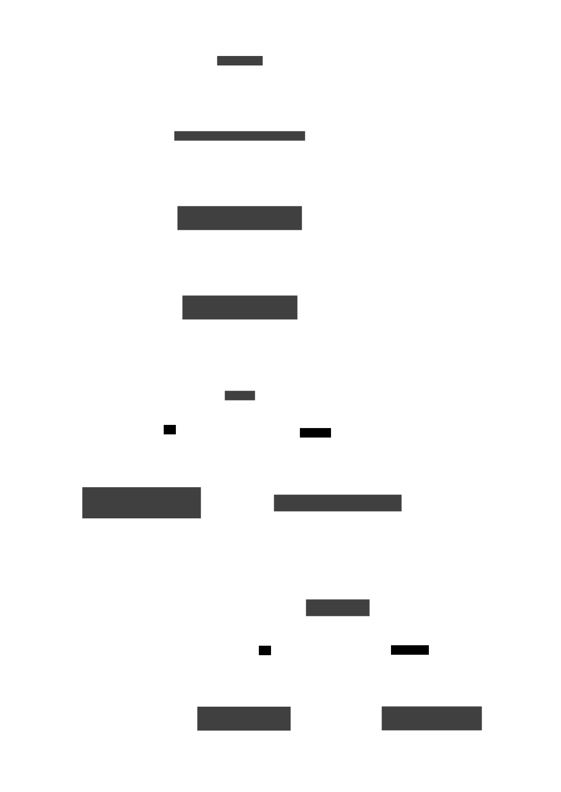

# Run Isolation & Safety — Architecture

This document describes how cloche isolates each vertical run, the finalize
protocol that lets runs merge into `main` safely (even concurrently), the resume
behavior, and the operational guardrails. File references are to the cloche product
repo unless prefixed with `wrapper:` (the `.cloche/` scripts of the orchestration
project).

## 1. The problem: cross-run contamination

A vertical run does work inside a container, then a sequence of **host** steps run
`git` against the project to publish branches and merge the stack into `main`.
Two facts about the old design combined into a corruption class:

1. The daemon seeded each container's `/workspace` from the **live shared working
   tree** of `repos/cloche`.
2. Host steps (`finalize`, `publish`) ran `git checkout` **in that same shared
   tree**, and the daemon **auto-resumed** interrupted runs by reusing their old
   container filesystem.

So if a host step left the shared tree on a feature branch, the next run's container
copied that stale tree, committed it, and `finalize` merged it back over `main` —
reverting unrelated commits (this repeatedly wiped the `token-limit` engine code, the
DSL identifier parser, and design-prep scenarios during development). Concurrency made
it worse: two runs mutating one working tree race on `HEAD`/index.

The fix is **per-run isolation**: take a clean snapshot of the base on the way in, do
all branch surgery in throwaway worktrees, and only ever advance `main` by a
fast-forward refspec push.

## 2. The run lifecycle



The numbered edges correspond to the sections below. The two green "page" nodes are
the isolation boundaries; the blue shared checkout is **never mutated** by a run.

## 3. Input isolation — clean per-run container snapshot (v3.18.0)

When the daemon launches a container, it records the base commit and seeds
`/workspace` from a **clean archive of that commit**, not the live tree.

- `baseSHA := gitHEAD(req.ProjectDir)` — `internal/adapters/grpc/server.go:1464`
  (`gitHEAD` is `git rev-parse HEAD`, `server.go:3857`).
- The seed block — `server.go:1482-1506`:

  ```go
  // Seed the container from a CLEAN per-run snapshot of the project at
  // baseSHA rather than the live working tree. Host workflow steps mutate the
  // shared working tree (git checkout, etc.); copying the live tree would
  // leak a stale/dirty state into the container, which then commits and
  // finalizes it back over main.
  if baseSHA != "" {
      snapDir, cleanup, snapErr := materializeCleanSnapshot(ctx, req.ProjectDir, baseSHA)
      if snapErr != nil {
          log.Printf("run %s: clean snapshot ... falling back to live tree: %v", runID, snapErr)
      } else {
          seedDir = snapDir
          defer cleanup()
      }
  }
  ```

- `materializeCleanSnapshot(ctx, projectDir, ref)` — `internal/adapters/grpc/snapshot_input.go:22`
  runs `git archive --format=tar <ref>` and extracts the tar into a temp dir, then
  returns that dir plus a cleanup func. The temp dir is what gets copied into the
  container; it is removed after `container.Start` returns.

Because `git archive <baseSHA>` emits **only tracked files as committed**, the
container can never see uncommitted/dirty state or a stray branch checkout. On any
error (non-git dir, empty `baseSHA`, archive failure) it **falls back to the live
tree** so nothing breaks.

## 4. Execution — per-step workspace snapshots

While the container runs, the daemon snapshots `/workspace` **after each successful
step**, providing the input for a later resume.

- Capture hook in the agent session — `server.go:353-370` (the
  `AgentMessage_StepResult` case): after a step completes it calls
  `captureWorkspaceSnapshot` in a goroutine when `shouldCaptureSnapshot` is true.
- `shouldCaptureSnapshot(result, run)` — `snapshot.go:14`: true only for a non-host
  (container) run, a non-skipped step, and a result that is **not** `fail`/`error`.
- Snapshots are tarballs under
  `.cloche/runs/<taskID>/snapshots/<attemptID>/<stepName>.tar`
  (`snapshotDir`/`snapshotPathForStep`, `snapshot.go:37-46`); `latestSnapshotPath`
  (`snapshot.go:48`) picks the newest by mtime.

## 5. Output isolation — extract, publish, close-on-publish

- **Extract worktree.** The daemon replays the container's commits onto a
  **per-run** worktree (`.gitworktrees/cloche/<run>-_default`) branched at `baseSHA`,
  then renames it to the expected stack branch. This is existing behaviour and is the
  output analogue of the input snapshot.
- **publish-branch is ref-only.** `wrapper:.cloche/scripts/vertical-publish-branch.sh`
  uses `git branch -f` (via `rename_extracted_to`) and `git push` — it **never checks
  out the working tree** (header comment, lines 52-56). So the shared checkout stays
  on `main`; `finalize` is the only host step that touches a working tree, and it does
  so in a throwaway worktree (§6).
- **Close-on-publish.** When a layer's branch is published *and* it succeeded, its
  tracker task is closed immediately (`vertical-publish-branch.sh:91-109`, gated on
  `implement_status == success`). This makes a completed layer durably "done" the
  instant its work is on origin, so a later failure or re-dispatch doesn't reselect it
  — whose no-diff re-implementation would otherwise wedge the strict verify.
- **`--allow-no-op` idempotency.** `wrapper:verify-changes.sh` takes `--allow-no-op`
  (lines 28-30, 54-56): if the previous step produced no new changes, treat it as
  success (the deliverable is already in the base) instead of failing. The test-plan
  and docs phases pass it; layer implementation does **not** (there, no diff means the
  agent failed and must fail loudly).

## 6. finalize — sync-forward before merge-back



`wrapper:.cloche/scripts/vertical-finalize.sh` merges the completed stack into the
base, and is the one place the design's **"sync-forward-before-merge-back"** rule is
enforced:

1. **Throwaway worktree** (lines 50-61, 103-104): `wt="$(mktemp -d)/finalize"` then
   `git worktree add --force -B "$top" "$wt" "origin/$top"`. An `EXIT` trap removes
   it. The shared checkout is never touched.
2. **Sync-forward rebase** (lines 106-125): inside the worktree,
   `git rebase "origin/$base"` replays the stack onto the *latest* base. On conflict
   it aborts and **fails loud** — the conflict is on the **feature branch in the
   worktree**, so the base is untouched and a human resolves it on that branch.
3. **Fast-forward refspec push** (lines 127-136):
   `git push origin "HEAD:refs/heads/$base"` — the rebased top is a descendant of
   `origin/$base`, so this is a clean fast-forward. **No force.** If the base moved
   again in the meantime the push is *rejected* and finalize fails (re-run to rebase
   onto the new base); it never force-overwrites the base.
4. **Cleanup**: delete the merged stack branches from origin, close the feature task,
   remove the worktree.

The base branch is **never checked out locally**, so: conflicts can only land on a
feature branch; the stack always incorporates (never reverts) commits that landed on
base during the run; and `main` only ever moves by fast-forward.

## 7. Resume — rebuild container, preserve workspace (v3.17.0)

`cloche resume` no longer reuses the original container's filesystem (which prevented
Dockerfile/image fixes from taking effect and was a vector for replaying stale state).
The modes — `internal/adapters/grpc/server.go:759-808`:

| Mode | CLI | Behavior |
|---|---|---|
| `resumeRebuild` (default) | *(none)* | Rebuild the container fresh from the project image (picks up Dockerfile/override fixes), re-apply the latest workspace snapshot. |
| `resumeReuse` | `--no-rebuild` | Reuse the committed container image, re-apply the latest snapshot. |
| `resumeClean` | `--clean` | Rebuild fresh, **no** snapshot (start clean). |

- CLI flag parsing → metadata: `parseResumeFlags` (`cmd/cloche/main.go:308`) maps the
  flags to `rebuild`/`reuse`/`clean`, sent as the `x-cloche-resume-rebuild` gRPC
  header (`main.go:358`); the server reads it via `resumeRebuildModeFromContext`
  (`server.go:791`).
- `modeUsesCommit` (`server.go:778`) is true only for `resumeReuse`; for rebuild/clean
  the resume path **skips `CommitForResume`** and resolves the image from project
  config (calling `EnsureImage` so a changed Dockerfile is rebuilt).
- `modeUsesSnapshot` (`server.go:784`) is true unless `resumeClean`; when set,
  `runResumedContainerWorkflow` injects `latestSnapshotPath(...)` into `/workspace`
  via `injectWorkspaceSnapshot` (`snapshot.go:94`) **before** the failed step is
  re-dispatched.

See the design doc:
[`docs/plans/2026-05-28-resume-rebuild-preserve-workspace.md`](../plans/2026-05-28-resume-rebuild-preserve-workspace.md).

## 8. Concurrency safety

With §3–§6 in place, two runs can finalize into `main` back-to-back without
corruption:

- They seed from independent clean snapshots and merge through independent throwaway
  worktrees, so they never race on the shared checkout.
- Whoever pushes second **rebases onto the first's result** (sync-forward) and
  fast-forwards; if they touch genuinely overlapping lines the second one's rebase
  conflicts **on its own feature branch** and fails loud — `main` is never corrupted.

One concrete sharp edge worth noting: when every BDD test plan appended its
initializer to a single `TestMain` list, two design tasks conflicted on that exact
line. **godog self-registration** (v3.18.2) removes that shared edit:

- `features/scenario_registry_test.go:1-29` defines a package-level
  `scenarioInitializers []func(*godog.ScenarioContext)`, a `registerScenarios(fn)`
  helper, and `applyScenarioInitializers` (wired as `TestMain`'s `ScenarioInitializer`).
- Each feature's `_test.go` self-registers via `func init() {
  registerScenarios(initMyFeatureScenarios) }`, so adding a feature touches only its
  own file — no shared list, no merge conflict.

## 9. Operational guardrails

### token-limit (v3.16)

Per-step and per-workflow **output**-token ceilings, enforced by the engine
(`internal/engine/engine.go`). Defaults `DefaultStepTokenLimit = 500_000`,
`DefaultWorkflowTokenLimit = 2_000_000` (`engine.go:19-20`).

- Per-step: if a step's `OutputTokens` exceed its limit, its result is overridden to
  `token-limit` (`engine.go:322`); `token-limit = 0` short-circuits before the
  executor runs (`engine.go:204`).
- Per-workflow: a running accumulator aborts the run when cumulative output reaches
  the workflow ceiling (`engine.go:332`); a workflow `token-limit = 0` aborts before
  any step (`engine.go:246`).
- Sentinels: `-1` disables enforcement, `0` aborts immediately. Input tokens are not
  counted.
- The DSL parser accepts `token-limit` on step and workflow blocks
  (`internal/dsl/parser.go:299, 541`) and adds an implicit `token-limit -> abort` wire
  for every step (`parser.go:241-273`), overridable with a workflow-level
  `token-limit -> <step>` shorthand. Full reference: [workflows.md](../workflows.md).

### cloche loop stop --hard (v3.18.1)

`cloche loop stop` only halts *new* dispatch; runs already in flight remain
**resumable** and would auto-resume when the daemon restarts (e.g. for a rebuild).
`--hard` additionally **parks** those runs so a restart starts clean — the missing
"emergency brake" for safe maintenance.

- CLI: `cmdLoopHardStop` (`cmd/cloche/loop.go:37`) calls the daemon and prints
  `Shut down N running task(s) (parked; will not resume on restart)`.
- RPC: `QuiesceRuns` (`server.go:3539`) → `store.ParkRunsByProject`, setting runs to
  `RunStateParked` (`internal/domain/run.go:RunStateParked`), which the restart logic
  skips.
- The auto-resume decision is **gated on the loop running** (`server.go:~3600`,
  `loop.Running()`), and `cloche loop status` surfaces the parked/resumable count
  (`ResumableRunsCount` via `GetProjectInfo`).

Safe-maintenance sequence:

```
cloche loop stop --hard      # halt dispatch + park in-flight runs
make install                 # rebuild — nothing auto-resumes
cloche loop                  # restart dispatch when ready
```

## 10. How it fits the broader system

The vertical workflow (`wrapper:.cloche/vertical.cloche`) drives the lifecycle:

```
claim → plan-feature → bdd-test-plan → publish-test-plan → record-test-plan
      → pick-next-layer ⇄ (implement-layer → publish-layer → check-layer-status → close-layer)
      → update-docs → broader-docs → publish-docs → finalize → cleanup
```

The daemon (`cloched`) owns container lifecycle and the KV store; the host executor
runs the host steps; the engine enforces wiring and `token-limit`. Run isolation is
the contract between them: **the daemon hands each run a clean view of the base, and
the run hands back a fast-forward — never a checkout of, or a force onto, the shared
tree or the base branch.** That contract is what makes concurrency and resume safe.
